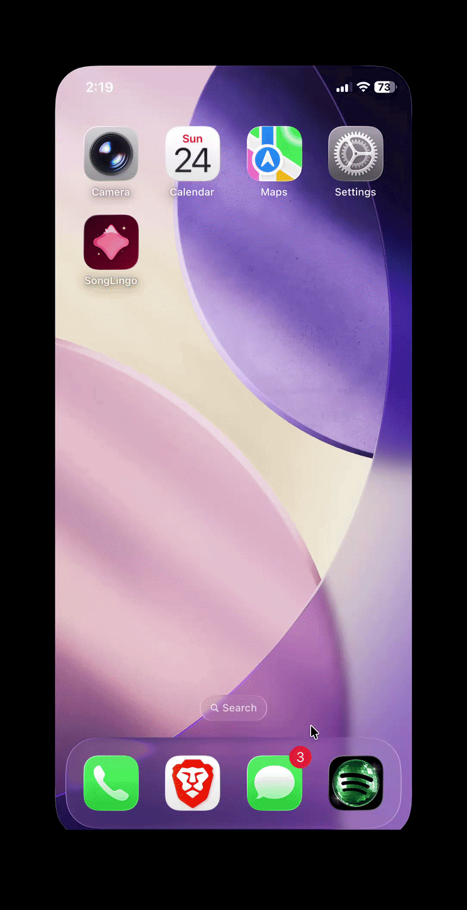
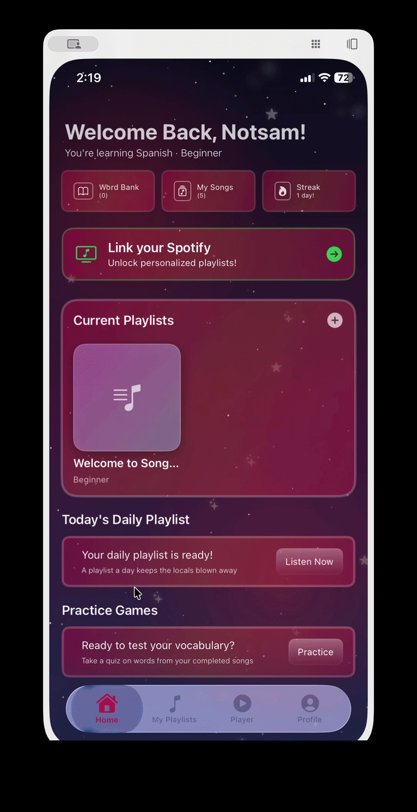
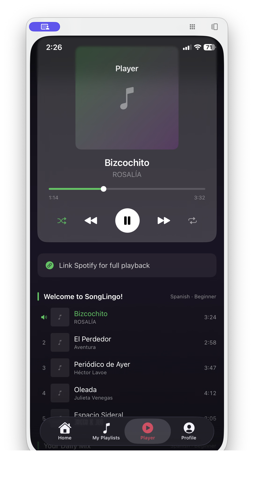
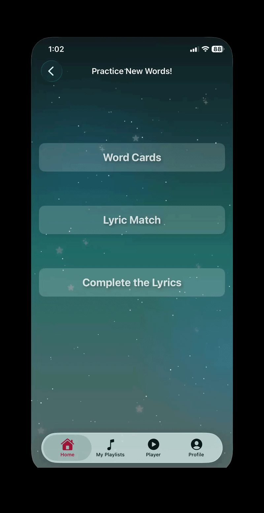
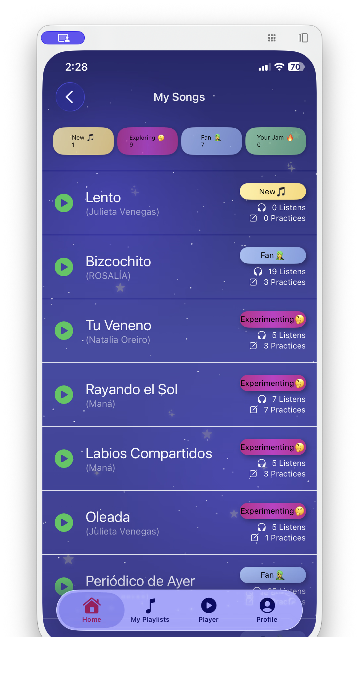
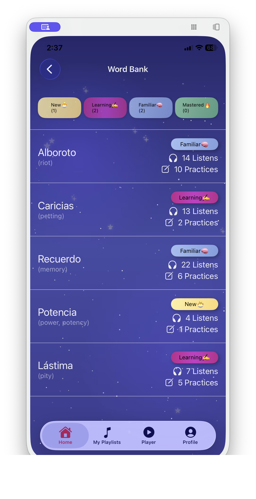

# SongLingo

## App Gallery

<table align="center">
  <tr>
    <td></td>
    <td></td>
    <td></td>
  </tr>
  <tr>
    <td align="center"><b>Seamless Onboarding</b></td>
    <td align="center"><b>Personalized Setup</b></td>
    <td align="center"><b>User Dashboard</b></td>
  </tr>
  <tr>
    <td></td>
    <td></td>
    <td></td>
  </tr>
  <tr>
    <td align="center"><b>Interactive Practice</b></td>
    <td align="center"><b>Spotify Integration</b></td>
    <td align="center"><b>Progress Tracking</b></td>
  </tr>
</table>

SongLingo is a dynamic language learning application that helps users learn new languages through the power of music. By integrating with Spotify and Genius, it provides an immersive experience where users can study lyrics, practice pronunciation, and track their vocabulary progress.

## Features
- **Lyric Integration**: Fetch and process lyrics from popular songs.
- **Language Learning**: Interactive tools to translate and learn words from your favorite music.
- **Pronunciation Support**: Integrated pronunciation server to help with accent and speaking.
- **Cross-Platform**: Powerful Django backend with a native iOS frontend.

## Getting Started

### Prerequisites
- [Docker](https://www.docker.com/get-started) and Docker Compose.
- [Spotify Developer Account](https://developer.spotify.com/) for API credentials.
- [Genius API Client](https://genius.com/api-clients) for lyric access.

### Setup & Run
1. **Clone the repository**:
   ```bash
   git clone <repository-url>
   cd song-lingo
   ```

2. **Configure Environment Variables**:
   Create a `.env` file in the root directory (refer to `.env.example` or use the following template):
   ```env
   SECRET_KEY=your_django_secret_key
   SPOTIFY_CLIENT_ID=your_spotify_id
   SPOTIFY_CLIENT_SECRET=your_spotify_secret
   GENIUS_ACCESS_TOKEN=your_genius_token
   SPOTIPY_REDIRECT_URI="your_redirect_uri"
   ```

3. **Run with Docker Compose**:
   ```bash
   docker-compose up --build
   ```
   This will start the backend (Django), database (PostgreSQL), and pronunciation server (MCP).

   * Refer to [backend/README.md](src/backend/README.md) for django specific setup and run instructions
   * Refer to [ios/README.md](src/ios/README.md) for iOS specific setup and run instructions

## Repository Structure Overview

- `src/backend/`: Django REST Framework application handling API, business logic, and database interactions.
- `src/ios/`: Native Swift application for the iOS platform.
- `src/mcp/`: Model Context Protocol server providing pronunciation services using gTTS.
- `docs/`: Project documentation, including architecture and citations.
- `docker-compose.yml`: Main orchestration file for running the entire stack.

## Design & Architecture

- **Figma Wireframe**: [View Figma Design](https://www.figma.com/design/GXeGcyl562g9byIwVufdXt/Group-7---Wireframe?node-id=0-1&t=LeB6mmdlXiCu73t6-1)
- **C4 Diagram**: [View Rendered C4 Diagram](docs/architecture/README.md)
  - The architecture is defined using Structurizr DSL in `docs/architecture/workspace.dsl`.
- **ER Diagram**: [View ER Diagram for Django Models](https://www.figma.com/board/OcoFMlVygslT1AxoYYh0r3/ER-Diagram?node-id=0-1&t=wMZGSM8Lqxqj127S-1)

## Code Style Standards

- **Python (Backend & MCP)**: Adheres to [PEP 8](https://peps.python.org/pep-0008/) standards.
- **Swift (iOS)**: Follows the [Swift API Design Guidelines](https://www.swift.org/documentation/api-design-guidelines/).

## Component Documentation
For specific setup and run instructions, see the component READMEs:
- [Backend README](src/backend/README.md)
- [iOS README](src/ios/README.md)
